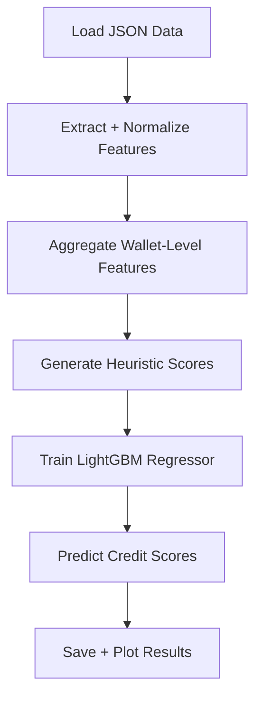

# 🎯 DeFi Wallet Credit Scoring

This project builds a robust machine learning model to assign a **credit score (0–1000)** to wallets interacting with the **Aave V2 protocol**, based solely on **historical transaction behavior**. The goal is to distinguish responsible, consistent DeFi users from risky, bot-like, or exploitative actors.

---

## 📊 Data Source

The model is trained on raw, transaction-level data from Aave V2.  
Each record in `user-wallet-transactions.json` corresponds to a wallet action:

- `deposit`
- `borrow`
- `repay`
- `redeemUnderlying`
- `liquidationCall`

---

## 🧠 Methodology

The credit scoring process follows this pipeline:

### 1. 🔧 Feature Engineering

We aggregate wallet-level features from raw transactions:

| Feature | Description |
|--------|-------------|
| `total_transactions` | Total number of transactions |
| `unique_days_active` | Distinct active days |
| `time_span_days` | Days between first and last transaction |
| `total_deposit_volume_usd` | Total deposited volume (USD) |
| `total_borrow_volume_usd` | Total borrowed volume (USD) |
| `total_repay_volume_usd` | Total repaid volume (USD) |
| `total_redeem_volume_usd` | Total redeemed (withdrawn) volume (USD) |
| `liquidation_count` | Number of liquidation events |
| `liquidation_volume_usd` | Total liquidation value (USD) |
| `repay_ratio` | `repay_volume / borrow_volume` (>=1 is good) |
| `redeem_ratio` | `redeem_volume / deposit_volume` (>=1 is good) |
| `transactions_per_day` | Activity intensity per active day |

All monetary values are calculated as `amount * assetPriceUSD`.

---

### 2. 🧮 Heuristic-Based Credit Score

Since true credit labels are unavailable, we define a **heuristic scoring logic**:

- **Base Score**: 500
- **Positive Factors**:
  - High `total_transactions`, `repay_ratio`, `redeem_ratio`, etc.
  - Rewarded proportionally (scaling + normalization)
- **Negative Factors**:
  - `liquidation_count`: Heavily penalized (non-linear)
  - `liquidation_volume_usd`: Penalized via log scale
- **Final Score**:
  - Clipped to 0–1000
  - Scaled to maximize spread

---

### 3. 🤖 Machine Learning Model

A **LightGBM Regressor** is trained on the engineered features and heuristic scores.

- Handles non-linear relationships
- Fast and efficient for tabular data
- Supports explainability and tuning

---

## ⚙️ Processing Flow


```
DeFi-Credit-Scoring/
│
├── score_generator.py        # Main script for scoring
├── user-wallet-transactions.json  # Raw Aave V2 data
├── wallet_credit_scores.csv  # Output file with scores
└── README.md                 # Project overview
```

##🚀 Extensibility

This framework is modular and can be enhanced further:
- Advanced Features: Time-decay metrics, transaction graph features, anomaly detection
- External Data: Integrate other DeFi protocols or CEX data
- Model Improvements: Try neural nets, stacking, or AutoML
- Real-Time Scoring: Adapt for streaming inputs
- Domain Expertise: Calibrate heuristics with expert feedback
